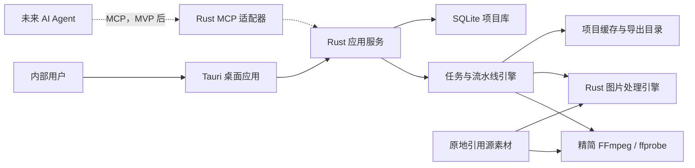
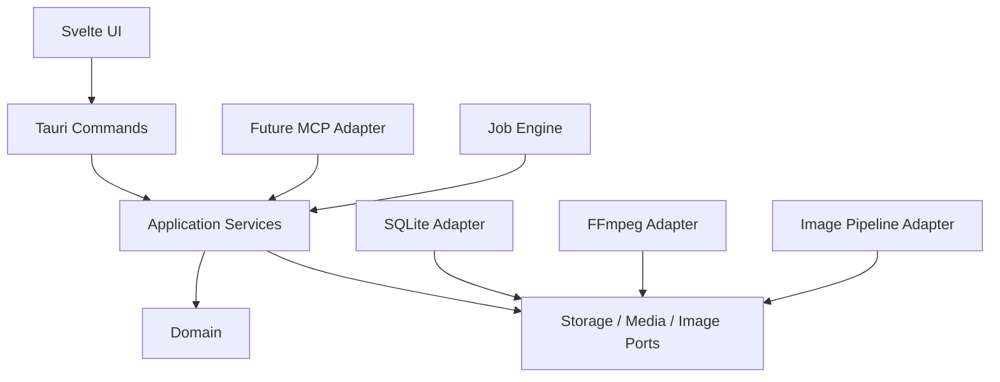
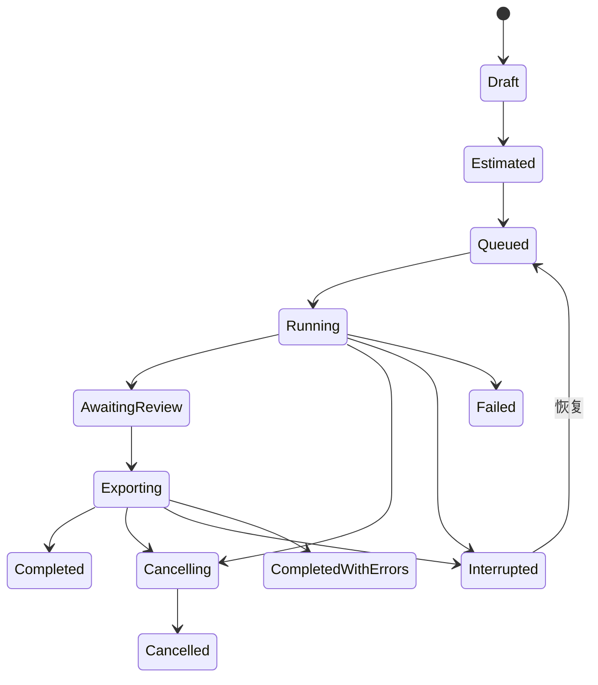

# Free-Train 软件架构设计

## 1. 架构目标

- UI、业务规则、媒体处理和持久化相互隔离。
- 桌面 UI 与未来 MCP 复用同一套应用服务。
- 大视频和大图片集合采用流式、有界并发和虚拟化处理。
- 每个阶段可检查、可取消、可恢复、可根据参数变化精确失效缓存。
- 源素材永不被业务流程修改或删除。
- 标准安装包保持约 40-70 MB，不携带 Python、Qt、OpenCV、Node.js 或 Chromium。

## 2. 系统上下文



## 3. 技术栈

### 3.1 桌面与前端

- Tauri 2：窗口、拖放、文件对话框、系统菜单、命令桥接和安装打包。
- Svelte + TypeScript + Vite：界面、状态展示和交互。
- Windows WebView2：前端渲染运行时。
- `lucide-svelte`：统一工具图标。
- 虚拟列表库：缩略图、素材列表和任务日志的虚拟滚动。

Node.js 只用于开发和构建，不进入最终运行包。

### 3.2 Rust 服务

- `serde` / `serde_json`：命令、配置、任务清单和导出清单。
- `thiserror`：领域错误和应用错误。
- `tracing`：结构化日志和任务诊断。
- `rusqlite`：SQLite 访问，由专用数据库执行器串行管理连接和事务。
- `rayon`：CPU 密集型图片操作的有界并行。
- `tokio`：Tauri 命令、子进程、事件和任务协调。
- `image`、`imageproc`、`fast_image_resize`、`palette`：图片处理。
- `sha2`、pHash 实现和 SSIM/DSSIM 实现：精确重复与视觉近重复分析。
- `rand_chacha`：确定性增强随机数。

具体第三方库在技术验证阶段锁定版本，领域接口不得暴露库特有类型。

### 3.3 视频能力

- `ffprobe` 输出 JSON 元数据：时长、分辨率、帧率、时间基、编码、旋转、创建时间。
- `ffmpeg` 负责时间戳准确解码、顺序扫描、指定时间抽帧和图片管道输出。
- FFmpeg 使用参数数组启动，不通过拼接 Shell 命令执行。
- 精简构建只保留产品需要的容器、解码器、滤镜和图片输出能力。

## 4. 推荐仓库结构

```text
Free-Train/
├─ Cargo.toml                     # Rust workspace
├─ package.json                   # 前端开发依赖
├─ pnpm-lock.yaml
├─ README.md
├─ CONTEXT.md
├─ apps/
│  └─ desktop/
│     ├─ src/                     # Svelte 前端
│     ├─ src-tauri/               # Tauri 入口、能力配置和打包
│     └─ tests/
├─ crates/
│  ├─ domain/                     # 纯领域类型、规则和状态机
│  ├─ application/                # 用例、权限、事务和 DTO
│  ├─ storage/                    # SQLite、迁移和仓库实现
│  ├─ media/                      # ffprobe/ffmpeg 适配器
│  ├─ image-pipeline/             # ROI、切图、质检、相似和增强
│  ├─ job-engine/                 # 队列、并发、取消、检查点
│  ├─ manifest/                   # JSONL/CSV 与命名模板
│  └─ mcp-adapter/                # 后续阶段启用
├─ resources/
│  ├─ ffmpeg/
│  ├─ icons/
│  └─ licenses/
├─ tests/
│  ├─ fixtures/
│  ├─ golden/
│  └─ performance/
└─ docs/
```

## 5. 分层与依赖规则



依赖约束：

- `domain` 不依赖 Tauri、SQLite、FFmpeg 或前端协议。
- `application` 只依赖领域对象和端口接口。
- UI 与 MCP 只能调用应用服务 DTO，不能直接读写数据库。
- 媒体和图片库的错误在适配器边界转换为稳定应用错误码。
- 文件路径在进入适配器之前完成规范化和允许范围校验。

## 6. 核心模块

### 6.1 Project Service

负责项目创建、打开、数据库迁移、工作目录、应用版本兼容和项目锁。

关键规则：同一项目默认只允许一个可写桌面实例；检测到已有锁时提供只读打开或明确接管流程。

### 6.2 Source Service

负责导入、元数据探测、来源组、来源标识、拍摄时间证据和离线素材重新定位。

大文件指纹建议分层计算：

1. 快速身份：文件大小、修改时间、文件标识符。
2. 快速内容指纹：头部、中部和尾部固定区块哈希。
3. 完整 SHA-256：精确去重或需要高可信重新定位时后台计算。

### 6.3 Video Selection Service

负责自动抽帧计划、人工抽帧、有效片段和变化触发分析。

变化触发分析使用降采样亮度图、直方图或结构差异产生客观变化分数。算法只负责选择候选时间点，不输出事件类别。

### 6.4 ROI and Tiling Service

负责 ROI 坐标校验、缩放策略、切片网格、重叠率和边缘处理。

坐标规则：

- 数据库存储以 EXIF/视频旋转校正后的逻辑画面为坐标系。
- ROI 使用整数像素边界，右边界和下边界采用半开区间。
- 切片保留输出坐标、源坐标、行列编号和边缘策略。
- 预览与最终处理必须调用同一坐标计算函数。

### 6.5 Quality Service

输出客观测量，不输出“内容价值”。首版指标建议：

- 解码状态。
- 宽、高、像素数和宽高比。
- 清晰度：Laplacian 方差或经过验证的等价指标。
- 曝光：亮度直方图、暗部/高光裁切比例。
- 低信息量：灰度标准差、熵或边缘密度组合。

阈值配置和算法版本共同构成质量评估版本。

### 6.6 Similarity Service

处理流程：

1. SHA-256 识别内容完全相同文件。
2. 按默认比较键分区：来源、ROI、切片位置和视频时间窗口。
3. pHash 产生候选近邻。
4. 临界候选通过 SSIM 二次确认。
5. 使用并查集或图连通分量生成相似组。
6. 质量评分选出确定性代表图。

禁止把相似关系直接转换为物理删除操作。

### 6.7 Review Service

保存自动建议和人工决策的分离状态：

- 自动建议可以随算法或阈值重算。
- 人工锁定、保留、排除和恢复不会被重算静默覆盖。
- 每次人工操作形成审计记录，并支持撤销/重做。

### 6.8 Augmentation Service

增强配方使用版本化 JSON Schema。执行器输入为解码后的标准像素缓冲、配方、种子和候选上下文，输出图片及实际应用参数。

基础 Rust 执行器必须满足：

- 同种子可复现。
- 预览和导出共用执行代码。
- 操作顺序明确。
- 不支持的操作在运行前校验失败。
- 每张变体写入执行器名称和版本。

未来高级执行器通过隔离进程接入，使用结构化 IPC，不加载到主 UI 进程。

### 6.9 Naming and Export Service

命名模板先解析为 AST，而不是运行时直接拼接字符串。字段渲染、非法字符清理、长度限制和冲突检测分别执行。

导出采用两阶段提交：

1. 生成导出计划并验证全部目标路径。
2. 写入临时文件，计算内容哈希，原子重命名并提交清单记录。

单个文件失败时标记失败，其他成功文件不回滚；任务总状态为“完成但有错误”。

## 7. 处理流水线与缓存 DAG


阶段缓存键至少包含：

- 输入内容指纹。
- 阶段参数规范化 JSON 的哈希。
- 上游缓存键。
- 算法和执行器版本。
- 软件兼容版本。

参数失效示例：

- 修改命名模板只失效导出计划和导出。
- 修改相似阈值只失效相似分组和后续审核建议，不重新抽帧。
- 修改 ROI 失效切片及其后的质量、相似和导出。
- 修改抽帧间隔失效候选生成及所有下游阶段。

## 8. 任务状态机



每个任务由多个可检查点阶段组成。取消令牌在文件之间、帧批次之间和图片操作之间检查；FFmpeg 当前不可中断调用结束后再响应取消。

## 9. 并发模型

- UI 主线程只负责渲染和事件。
- Tauri 异步命令负责短操作和请求协调。
- FFmpeg 子进程数量受到任务并发限制。
- CPU 图片处理使用独立 Rayon 线程池，并根据内存预算限制在途图片数量。
- SQLite 写入通过单一执行器或短事务串行化，避免跨线程长事务。
- 缩略图加载使用低优先级队列，不能抢占用户正在预览的媒体。
- 每个任务记录内存预算、并发度和临时磁盘预算。

## 10. 项目数据与文件布局

```text
project.ftproj/
├─ project.sqlite
├─ project.json
├─ cache/
│  ├─ thumbnails/
│  ├─ decoded/
│  ├─ tiles/
│  └─ analysis/
├─ jobs/
│  └─ <job-id>/
│     ├─ snapshot.json
│     ├─ checkpoints/
│     └─ report.json
├─ logs/
└─ locks/
```

最终预处理成品默认写入项目外的用户指定目录。项目内缓存可清理和重建，数据库和任务快照不可作为普通缓存删除。

## 11. SQLite 核心表

- `projects`
- `source_assets`
- `source_groups`
- `source_fingerprints`
- `roi_presets`
- `source_rois`
- `video_selections`
- `pipeline_presets`
- `processing_jobs`
- `job_stages`
- `candidate_images`
- `quality_assessments`
- `similarity_groups`
- `similarity_members`
- `review_decisions`
- `augmentation_recipes`
- `prepared_images`
- `provenance_records`
- `audit_events`
- `schema_migrations`

记录使用 UUID 或同等稳定标识，时间统一存储为 UTC，并在界面按本地时区显示。

## 12. 错误模型

稳定错误类别：

- `validation.*`：参数或模板无效。
- `source.*`：素材离线、替换、损坏或不支持。
- `media.*`：ffprobe、解码、时间戳或编码错误。
- `image.*`：解码、ROI、切图、质量、相似或增强错误。
- `storage.*`：数据库、磁盘空间、权限或原子写入错误。
- `job.*`：取消、中断、恢复或阶段状态错误。
- `security.*`：路径越界、权限不足或外部进程校验失败。

错误 DTO 包含稳定代码、用户可读信息、可选技术详情、来源标识和是否可重试。

## 13. 安全设计

- 源素材路径只读打开。
- 缓存清理只能作用于项目声明的缓存目录。
- 导出前规范化路径，并验证位于用户选择的导出根目录内。
- 外部进程参数不通过 Shell 解析。
- FFmpeg 可执行文件在安装时随资源校验。
- 项目数据库不执行来自模板或清单的任意 SQL。
- 未来 MCP 默认只读；写操作使用明确权限和桌面确认。

## 14. 打包与发行

- Tauri 生成 Windows 标准安装包和便携版。
- 标准安装包检测 WebView2，缺失时通过官方引导程序安装。
- FFmpeg、第三方 Rust 库和前端依赖许可证放入 `resources/licenses/`。
- 内部首版不实现自动更新和遥测。
- 数据库迁移必须向前兼容，并在升级前创建项目数据库备份。

## 15. 后续扩展点

- Rust MCP 适配器。
- Albumentations 高级增强进程。
- 托管项目与项目打包迁移。
- 语义多样性分析，但不得混入近重复去重结果。
- 标注格式适配器和标注同步几何变换。
- GPU 或硬件视频解码加速。

