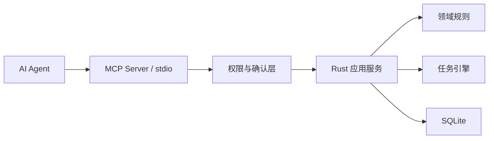
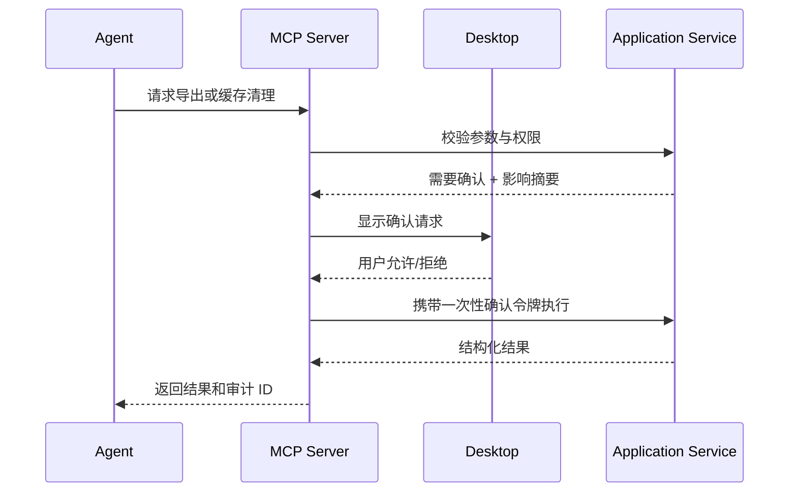

# Free-Train MCP 接口预留设计

## 1. 状态

MCP Server 不属于桌面 MVP。本设计用于约束首版应用服务边界，避免未来接入 AI Agent 时绕过业务规则或直接操作数据库。

## 2. 目标

- AI Agent 可以读取项目、检查素材和提出处理计划。
- Agent 调用与桌面 UI 调用产生一致结果。
- 文件访问严格限制在用户授权目录。
- 修改性操作可审计，并在必要时要求桌面端确认。
- MCP 协议版本变化不影响领域模型和 SQLite 内部结构。

## 3. 架构

MCP 适配器不得直接访问 SQLite 表、FFmpeg 或任意文件路径。

## 4. 建议传输方式

- 首选本地 `stdio` MCP Server，由用户或 Agent 宿主显式启动。
- 不在首版开放网络监听端口。
- Server 与桌面应用通过项目锁、应用服务库或受控本地 IPC 协作。

## 5. 权限模型

### 5.1 权限级别

- `project.read`：读取项目摘要、素材、预设、任务和清单。
- `project.plan`：校验配置和计算估算，不产生媒体文件。
- `job.run`：创建和取消处理任务。
- `review.propose`：创建待用户确认的审核建议，不覆盖人工决策。
- `export.run`：执行最终导出，需要项目授权和可选桌面确认。
- `cache.manage`：查看或清理缓存，必须桌面确认。

### 5.2 允许目录

- 每个项目保存源素材允许根目录和导出允许根目录。
- MCP 输入路径规范化后必须位于允许根目录内。
- 符号链接、`..`、大小写和 Windows 设备路径必须经过规范化处理。
- MCP 不能请求删除源素材。

## 6. 候选工具

| 工具 | 权限 | MVP 后首批 | 说明 |
|---|---|---|---|
| `list_projects` | `project.read` | 是 | 列出已授权项目 |
| `get_project_summary` | `project.read` | 是 | 数量、状态、空间和版本 |
| `list_sources` | `project.read` | 是 | 分页读取素材和离线状态 |
| `get_source_metadata` | `project.read` | 是 | 视频/图片元数据和来源标识 |
| `list_pipeline_presets` | `project.read` | 是 | 获取可用处理预设 |
| `validate_pipeline` | `project.plan` | 是 | 校验参数和兼容性 |
| `estimate_job` | `project.plan` | 是 | 预计候选数、输出数和磁盘 |
| `create_processing_job` | `job.run` | 是 | 通过参数快照创建任务 |
| `get_job_status` | `project.read` | 是 | 查询阶段、进度和错误 |
| `cancel_job` | `job.run` | 是 | 请求取消任务 |
| `list_review_summary` | `project.read` | 是 | 读取质量和相似审核汇总 |
| `propose_review_decisions` | `review.propose` | 后续 | 创建可审核建议，不直接提交 |
| `create_export_plan` | `project.plan` | 是 | 校验命名、冲突和磁盘 |
| `run_export` | `export.run` | 后续 | 需要确认的最终导出 |
| `read_export_manifest` | `project.read` | 是 | 分页读取追溯清单 |
| `get_cache_summary` | `project.read` | 后续 | 查看缓存空间 |
| `clear_cache` | `cache.manage` | 后续 | 必须确认且不能影响源素材 |

## 7. 资源设计

可选 MCP Resources：

- `freetrain://projects/{project_id}/summary`
- `freetrain://projects/{project_id}/sources/{source_id}`
- `freetrain://projects/{project_id}/jobs/{job_id}`
- `freetrain://projects/{project_id}/exports/{export_id}/manifest`

大型列表必须分页，图片二进制默认不作为资源直接返回；需要预览时返回受项目权限约束的缩略图资源或短期句柄。

## 8. 修改确认流程

确认令牌必须绑定项目、工具、参数摘要和短期有效期，不能复用于其他操作。

## 9. 审计

每次 MCP 调用至少记录：

- 调用 ID 和时间。
- 客户端/Agent 标识。
- 工具名称和协议版本。
- 项目 ID。
- 参数摘要，敏感路径按设置脱敏。
- 权限决策和确认 ID。
- 结果状态、错误码和受影响记录数。

## 10. 版本与兼容

- MCP DTO 使用显式 `schema_version`。
- 工具输入不暴露 SQLite 列名。
- 新增可选字段保持向后兼容。
- 删除或改变语义的字段通过新工具版本发布。
- 项目数据库迁移与 MCP 协议版本分别管理。

## 11. 安全测试要求

- 路径穿越和符号链接越界。
- 未授权项目访问。
- 只读权限执行写操作。
- 过期或参数不匹配的确认令牌。
- 大分页、超大参数和恶意模板输入。
- Agent 重复提交任务的幂等性。
- 缓存清理不能触及源素材和导出目录。

